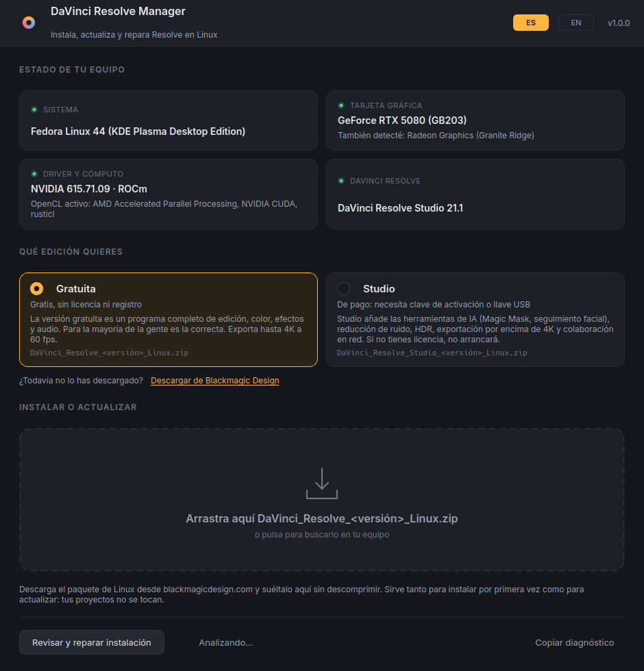
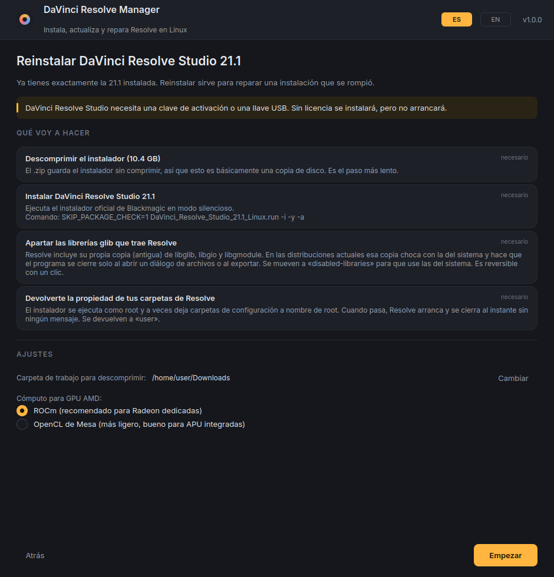
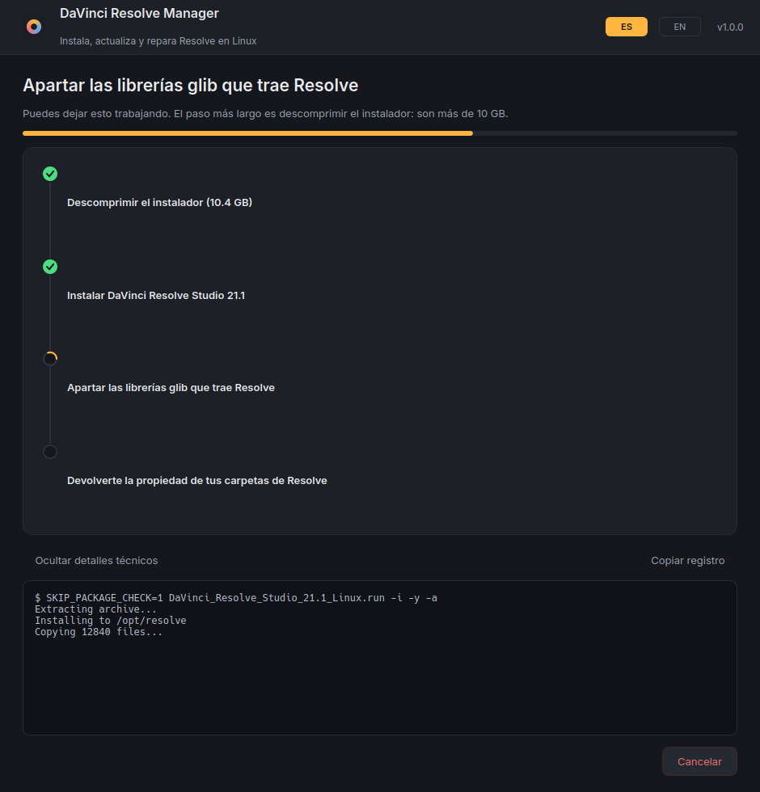
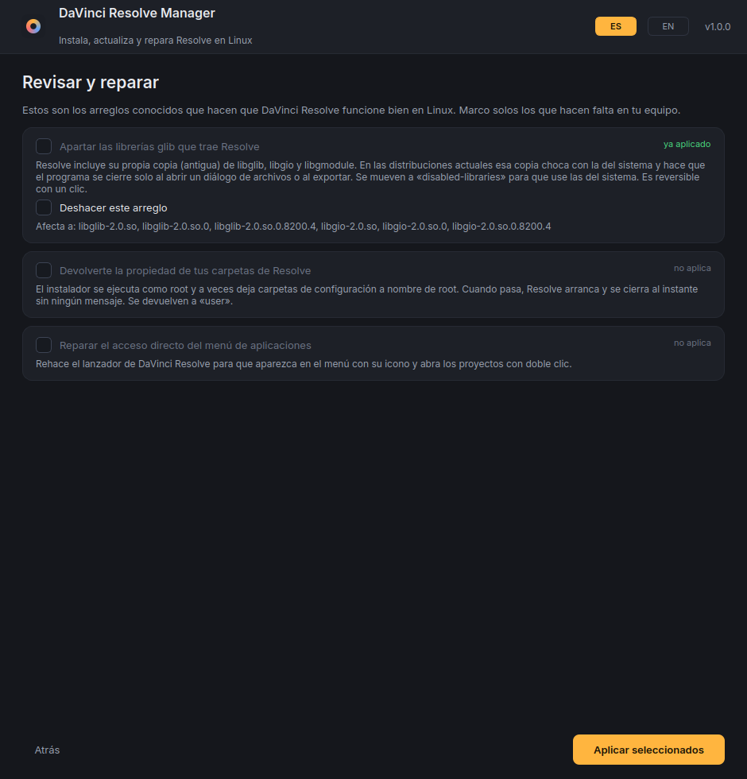

# DaVinci Resolve Manager

**Instala, actualiza y repara DaVinci Resolve en Linux arrastrando un archivo a una ventana.**

[]()
[]()
[]()
[](LICENSE)

🇬🇧 *[Read me in English](README.md)*

Instalar y actualizar DaVinci Resolve en Linux es innecesariamente difícil: el
instalador oficial aborta por un chequeo de paquetes que se equivoca de nombre,
hay que saber qué runtime de GPU instalar según la marca de tu tarjeta, y al
terminar todavía hay que apartar a mano unas librerías que vienen dentro o el
programa se cierra solo.

Esta aplicación hace todo eso por ti. Sueltas el `.zip` que descargaste de
Blackmagic sobre la ventana y se encarga del resto.



---

## Qué hace

**Instala desde cero y actualiza con el mismo gesto.** Detecta qué versión
tienes, la compara con la del paquete que sueltas y te dice si es instalación,
actualización, reinstalación o vuelta atrás. Tus proyectos y tu base de datos no
se tocan nunca: viven en tu carpeta personal, no en `/opt/resolve`.

**Gratuita o Studio, tú eliges.** Son dos descargas distintas, así que la
aplicación te pregunta cuál quieres, te explica qué te da cada una, te enlaza a
la descarga correcta y te avisa si el archivo que soltaste es el de la otra
edición.

**Habla español e inglés.** Sigue el idioma de tu sistema y hay un conmutador
`ES`/`EN` en la barra de título. La elección se recuerda.

**Esquiva el fallo del chequeo de paquetes.** El instalador de Blackmagic busca
un paquete llamado `zlib` y aborta si no lo encuentra. En Fedora ese paquete se
llama `zlib-ng-compat`, y en otras distribuciones tiene otro nombre. El
resultado es un `Installation cancelled` que no explica nada. La aplicación
lanza el instalador con `SKIP_PACKAGE_CHECK=1` y en modo silencioso
(`-i -y -a`), así que no ves ningún asistente ni ningún error falso.

**Pone los drivers y el runtime de GPU que te faltan.** Sabe qué necesita cada
combinación de distribución y tarjeta:

| Tu tarjeta | Qué instala | Por qué |
|---|---|---|
| AMD Radeon dedicada | ROCm (`rocm-opencl`, `rocm-hip`) | Sin esto Resolve dice «no GPU detected» |
| AMD integrada / APU | OpenCL de Mesa | Más ligero y suficiente para una iGPU |
| NVIDIA | Driver propietario + CUDA | Y activa RPM Fusion en Fedora, que es donde vive |
| Cualquiera | `libxcrypt-compat`, `ocl-icd` | Resolve enlaza contra `libcrypt.so.1`, que ya no viene de serie |

Si tus drivers ya funcionan, no toca nada. Solo propone lo que falta, y te
explica para qué sirve cada paquete antes de instalarlo.

**Aplica las reparaciones que hoy se buscan en foros.** Sobre todo la de las
librerías: Resolve trae su propia copia antigua de `libglib`, `libgio` y
`libgmodule`, que choca con la del sistema y hace que el programa se cierre solo
al abrir un diálogo de archivo o al exportar. La aplicación las aparta a
`disabled-libraries` — y puede devolverlas a su sitio con un clic si prefieres
volver atrás. También devuelve al usuario las carpetas que el instalador deja a
nombre de `root`, que es la causa de que Resolve arranque y desaparezca sin
mensaje.

**Te pide la contraseña una sola vez.** Todo el trabajo que necesita permisos se
manda de golpe a un ayudante privilegiado, en vez de ir pidiendo autorización
paso a paso.

---

## Instalación

```bash
cd resolve-manager
./install.sh
```

Comprueba que tengas PyQt6 (y se ofrece a instalarlo), crea el lanzador y añade
la entrada al menú de aplicaciones. No necesita root: todo va a tu carpeta
personal.

Después búscalo en el menú como **DaVinci Resolve Manager**, o ejecútalo con:

```bash
~/.local/bin/davinci-resolve-manager
```

Para quitarlo (no toca DaVinci Resolve):

```bash
./install.sh --uninstall
```

### Requisitos

- Python 3.9 o superior
- PyQt6
- `pkexec` (polkit) o `sudo` para los pasos que necesitan permisos

---

## Cómo se usa

1. Elige **Gratuita** o **Studio** en la pantalla principal. Si aún no lo has
   descargado, el enlace te lleva a la página correcta.
2. Descarga el paquete de Linux desde
   [blackmagicdesign.com](https://www.blackmagicdesign.com/support/family/davinci-resolve-and-fusion).
   No lo descomprimas.
3. Arrastra el `.zip` a la ventana.
4. Lee lo que propone hacer y pulsa **Empezar**.
5. Escribe tu contraseña cuando el sistema la pida. Una vez.

El paso más largo es descomprimir: el instalador ocupa más de 10 GB y el `.zip`
lo guarda sin comprimir, así que es básicamente una copia de disco. Si ya
descomprimiste ese `.run` antes, lo reutiliza en vez de repetir el trabajo.

El botón **Revisar y reparar instalación** sirve para arreglar una instalación
que ya tienes, sin volver a instalar nada.

---

## Distribuciones

Probado en **Fedora 44** con NVIDIA RTX 5080 y Radeon integrada, en una
actualización real de 21.0.4 a Studio 21.1.

La matriz de paquetes cubre además las familias Debian/Ubuntu, Arch y openSUSE.
Esas rutas están escritas a partir de los nombres de paquete de cada distro pero
no se han podido probar en hardware real, así que trátalas como soporte
comunitario. Si tu distribución no se reconoce, la aplicación sigue pudiendo
instalar Resolve: se salta el paso de dependencias y te avisa.

En sistemas inmutables (Silverblue, Bazzite, SteamOS) instala Resolve en `/opt`
pero no las dependencias: esas hay que añadirlas con `rpm-ostree`.

---

## Capturas

| Te dice lo que va a hacer, antes de hacerlo | Y luego lo hace, informando de cada paso |
|---|---|
|  |  |

Reparar una instalación que ya tienes, sin reinstalar nada:



---

## Cómo está hecho

```
resolve_manager/
├── i18n.py            traducción español/inglés; el español es el idioma de origen
├── core/
│   ├── system.py      detecta distro, GPU, drivers, OpenCL y la versión instalada
│   ├── packages.py    matriz de dependencias por distribución y marca de GPU
│   ├── archive.py     lee el .zip y extrae el .run con progreso y cancelación
│   ├── fixes.py       reparaciones conocidas, cada una con detectar/aplicar/deshacer
│   ├── installer.py   convierte «este paquete + este equipo» en un plan ejecutable
│   ├── plan.py        modelo de datos del plan (viaja como JSON)
│   ├── state.py       recuerda lo que el sistema no sabe decirnos (p. ej. la edición)
│   ├── privileged.py  eleva permisos con pkexec, o con sudo si no hay escritorio
│   └── root_helper.py el ayudante que corre como root e informa del avance
└── ui/
    ├── theme.py       paleta y hoja de estilos
    ├── widgets.py     zona de arrastre, tarjetas, lista de pasos, barra de progreso
    ├── pages.py       las cinco pantallas y el selector de edición
    ├── worker.py      hilo de trabajo
    └── window.py      estado de la sesión y conexiones
```

El plan es una lista de acciones con datos planos. Las que necesitan permisos se
serializan a JSON y se ejecutan de una vez en `root_helper.py`, que va emitiendo
líneas JSON con el progreso. El ayudante solo sabe ejecutar cinco tipos de
acción (ejecutar un comando, apartar librerías, restaurarlas, cambiar
propietario y escribir el lanzador) y rechaza el plan entero si aparece
cualquier otra cosa.

**Sobre los permisos:** el ayudante se ejecuta con `pkexec`, igual que cualquier
instalador gráfico. El plan lo escribe tu propio usuario en un archivo privado
(`0600`) dentro de `$XDG_RUNTIME_DIR`. Como pasa con `sudo`, autorizar la
operación concede permisos de administrador: revisa la lista de pasos que te
enseña la pantalla anterior antes de aceptar.

---

## Si algo va mal

Cada pantalla tiene un desplegable **Mostrar detalles técnicos** con la salida
completa de todos los comandos, y un botón para copiarla. La pantalla de inicio
tiene **Copiar diagnóstico**, que copia un resumen del equipo (distribución,
kernel, GPUs, drivers, plataformas OpenCL y versión de Resolve) listo para pegar
en un foro o en un issue.

**Resolve arranca y se cierra al instante, sin mensaje.** Casi siempre son los
permisos de `~/.local/share/DaVinciResolve`. Usa *Revisar y reparar*.

**Se cierra al exportar o al abrir un diálogo de archivos.** Es el conflicto de
`libglib`. Usa *Revisar y reparar*.

**Dice que no encuentra la GPU.** Falta el runtime de OpenCL de tu marca. La
pantalla de inicio te lo dice en la tarjeta «Driver y cómputo».

**Instalaste Studio y no arranca.** Studio necesita clave de activación o llave
USB. Si no tienes licencia, descarga la edición Gratuita.

**Instalaste el driver de NVIDIA y sigue sin ir.** Hay que reiniciar: el driver
es un módulo del kernel y no se carga hasta el siguiente arranque.
