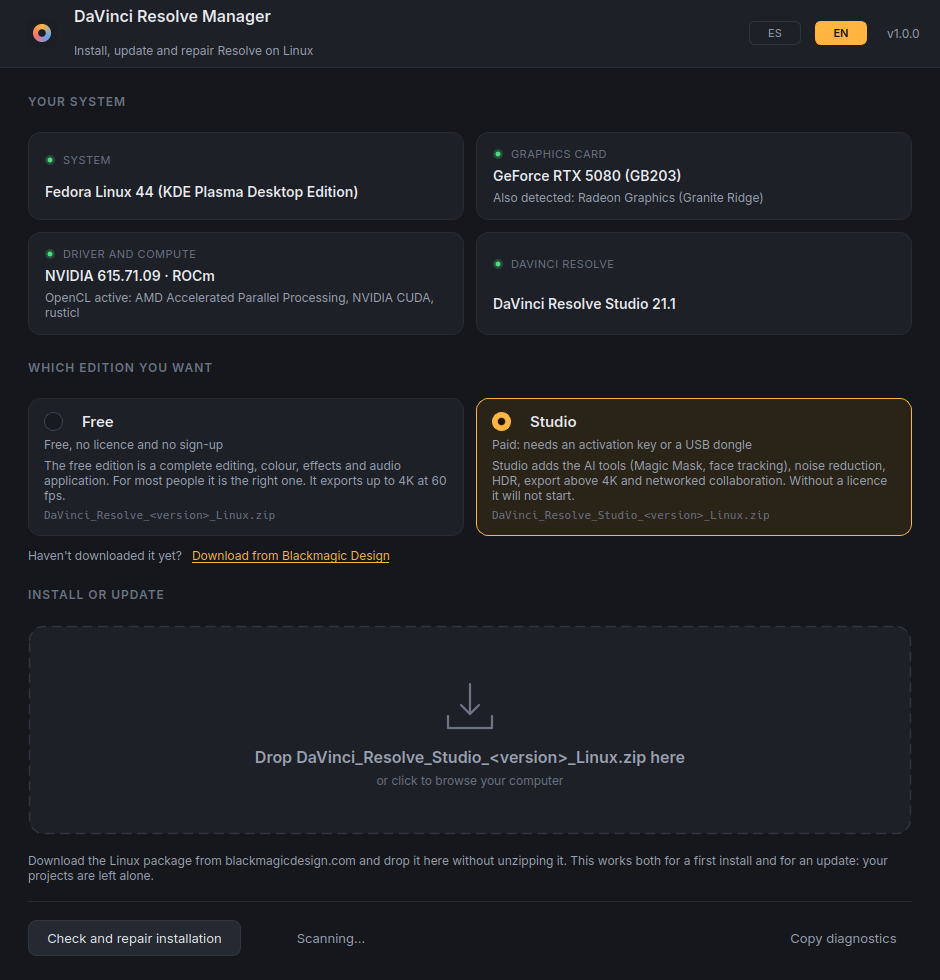
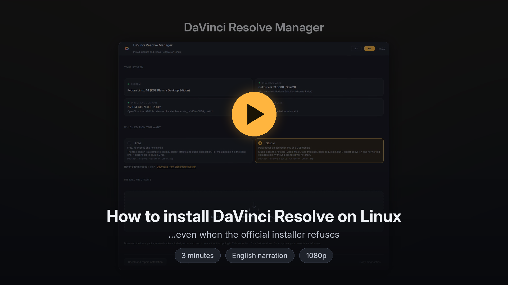
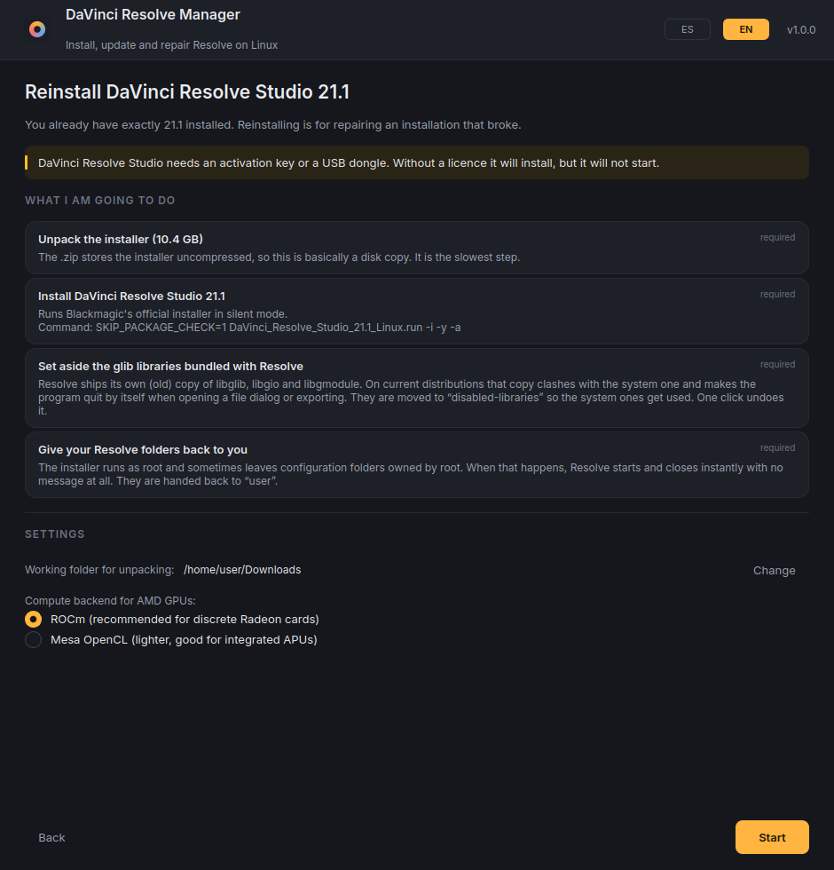
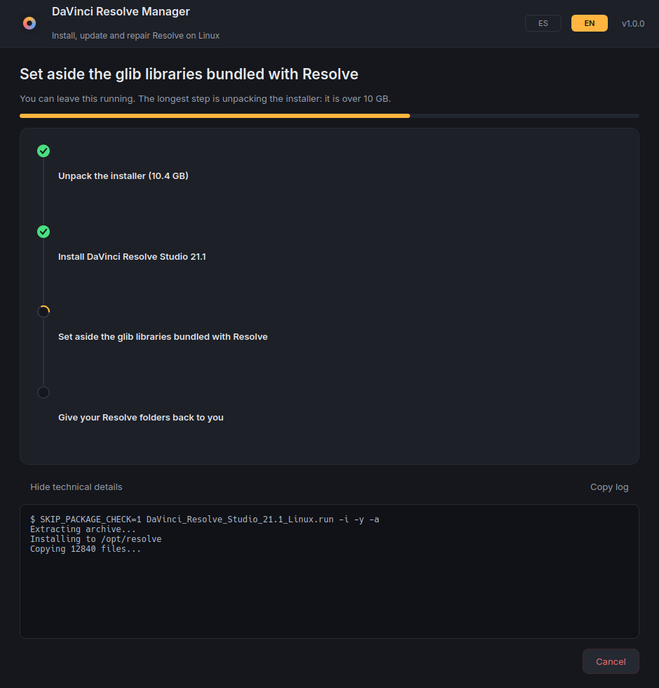
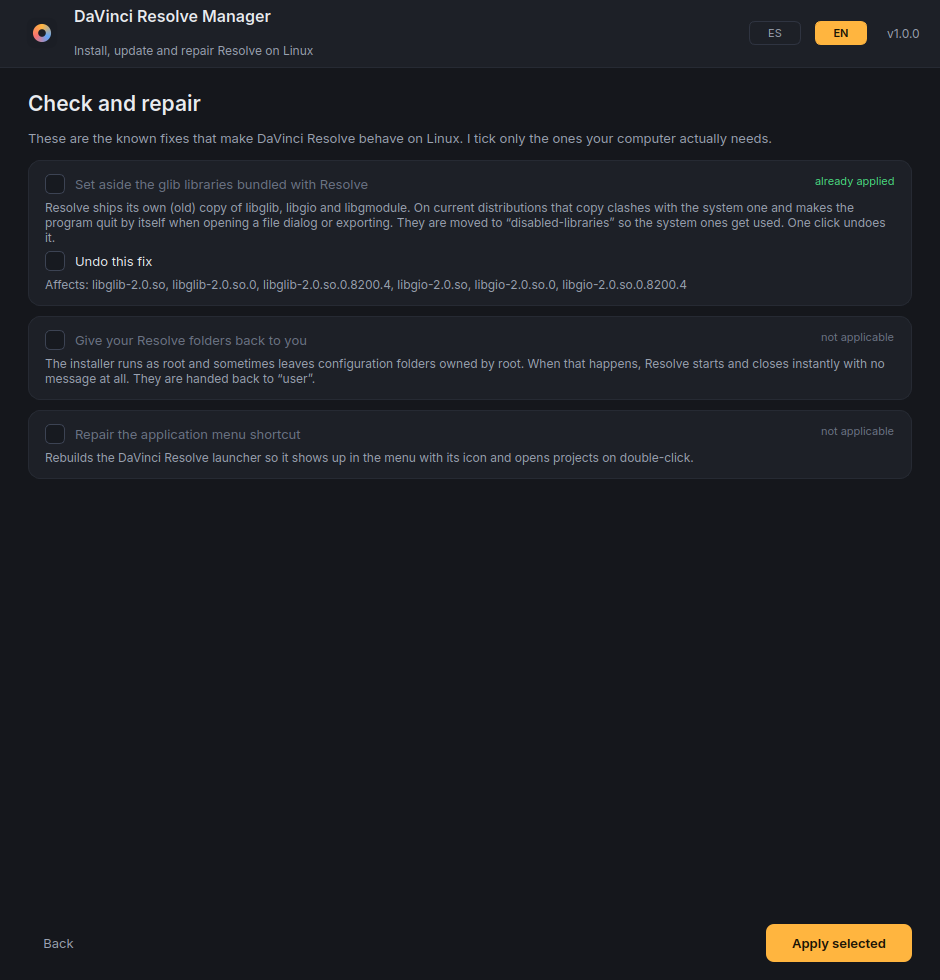

# DaVinci Resolve Manager

**Install, update and repair DaVinci Resolve on Linux by dragging one file onto a window.**

[]()
[]()
[]()
[](LICENSE)

🇪🇸 *[Léeme en español](README.es.md)*

Installing and updating DaVinci Resolve on Linux is needlessly hard. The
official installer aborts on a package check that gets the name wrong, you have
to know which GPU runtime to install for your brand of card, and when it is
finally done you still have to move some bundled libraries out of the way by
hand or the program quits by itself.

This app does all of that for you. Drop the `.zip` you downloaded from
Blackmagic onto the window and it takes care of the rest.



---

## Watch it in three minutes

[](https://github.com/Stevenkingx/DavinciResolve-Installer/releases/download/v1.0.0/DaVinci-Resolve-Manager-tutorial.mp4)

**[▶ Watch the tutorial](https://github.com/Stevenkingx/DavinciResolve-Installer/releases/download/v1.0.0/DaVinci-Resolve-Manager-tutorial.mp4)** — 1080p, English narration, 3:15. It walks
through the error you are probably hitting, why it happens, and the whole
install from dropping the zip to opening Resolve.

---

## What it does

**Installs from scratch and updates with the same gesture.** It detects which
version you have, compares it with the package you dropped and tells you whether
this is an install, an update, a reinstall or a rollback. Your projects and your
database are never touched: they live in your home folder, not in
`/opt/resolve`.

**Free or Studio, your choice.** The two editions are different downloads, so
the app asks which one you want, explains what each gives you, links to the
right download, and warns you if the file you dropped is the other edition.

**Speaks English and Spanish.** It follows your system language and there is an
`ES`/`EN` switch in the title bar. The choice is remembered.

**Works around the broken package check.** Blackmagic's installer looks for a
package called `zlib` and aborts if it cannot find it. On Fedora that package is
called `zlib-ng-compat`; other distributions name it differently. The result is
an `Installation cancelled` that explains nothing. The app runs the installer
with `SKIP_PACKAGE_CHECK=1` in silent mode (`-i -y -a`), so you never see a
wizard or a bogus error.

**Installs the drivers and GPU runtime you are missing.** It knows what each
combination of distribution and card needs:

| Your card | What it installs | Why |
|---|---|---|
| Discrete AMD Radeon | ROCm (`rocm-opencl`, `rocm-hip`) | Without it Resolve says "no GPU detected" |
| Integrated AMD / APU | Mesa OpenCL | Lighter and enough for an iGPU |
| NVIDIA | Proprietary driver + CUDA | And enables RPM Fusion on Fedora, where it lives |
| Any | `libxcrypt-compat`, `ocl-icd` | Resolve links against `libcrypt.so.1`, no longer installed by default |

If your drivers already work it touches nothing. It only proposes what is
missing, and explains what each package is for before installing it.

**Applies the fixes people currently hunt for in forums.** Chiefly the library
one: Resolve ships its own old copy of `libglib`, `libgio` and `libgmodule`,
which clashes with the system's and makes the program quit by itself when you
open a file dialog or export. The app moves them to `disabled-libraries` — and
can put them back with one click if you prefer. It also hands back the folders
the installer leaves owned by `root`, which is why Resolve sometimes starts and
vanishes with no message.

**Asks for your password once.** Everything that needs permissions is sent in
one batch to a privileged helper, instead of prompting step by step.

---

## Installing

```bash
cd resolve-manager
./install.sh
```

It checks for PyQt6 (and offers to install it), creates the launcher and adds
the menu entry. No root needed: everything goes into your home folder.

Then look for **DaVinci Resolve Manager** in your menu, or run:

```bash
~/.local/bin/davinci-resolve-manager
```

To remove it (DaVinci Resolve itself is left alone):

```bash
./install.sh --uninstall
```

### Requirements

- Python 3.9 or newer
- PyQt6
- `pkexec` (polkit) or `sudo` for the steps that need permissions

---

## Using it

1. Pick **Free** or **Studio** on the main screen. If you have not downloaded it
   yet, the link takes you to the right page.
2. Download the Linux package from
   [blackmagicdesign.com](https://www.blackmagicdesign.com/support/family/davinci-resolve-and-fusion).
   Do not unzip it.
3. Drag the `.zip` onto the window.
4. Read what it proposes to do and press **Start**.
5. Type your password when the system asks. Once.

The slowest step is unpacking: the installer is over 10 GB and the `.zip` stores
it uncompressed, so it is essentially a disk copy. If you have unpacked that
`.run` before, it is reused instead of doing the work again.

**Check and repair installation** fixes an existing install without reinstalling
anything.

---

## Distributions

Tested on **Fedora 44** with an NVIDIA RTX 5080 and an integrated Radeon, for a
real 21.0.4 → Studio 21.1 update.

The package matrix also covers the Debian/Ubuntu, Arch and openSUSE families.
Those paths are written from each distribution's package names but have not been
tested on real hardware, so treat them as community support. If your
distribution is not recognised the app can still install Resolve: it skips the
dependency step and tells you so.

On immutable systems (Silverblue, Bazzite, SteamOS) it installs Resolve into
`/opt` but not the dependencies: those you add with `rpm-ostree`.

---

## Screenshots

| It tells you what it will do, before doing it | And then does it, reporting every step |
|---|---|
|  |  |

Repairing an existing installation, without reinstalling anything:



---

## How it is built

```
resolve_manager/
├── i18n.py            Spanish/English translation; Spanish is the source language
├── core/
│   ├── system.py      detects distro, GPU, drivers, OpenCL and installed version
│   ├── packages.py    dependency matrix per distribution and GPU vendor
│   ├── archive.py     reads the .zip, extracts the .run with progress and cancel
│   ├── fixes.py       known repairs, each with detect / apply / undo
│   ├── installer.py   turns "this package + this machine" into a runnable plan
│   ├── plan.py        the plan data model (travels as JSON)
│   ├── state.py       remembers what the system cannot tell us (e.g. the edition)
│   ├── privileged.py  elevates with pkexec, or sudo when there is no desktop
│   └── root_helper.py the helper that runs as root and reports progress
└── ui/
    ├── theme.py       palette and stylesheet
    ├── widgets.py     drop zone, cards, step pipeline, progress bar
    ├── pages.py       the five screens and the edition chooser
    ├── worker.py      background thread
    └── window.py      session state and wiring
```

The plan is a list of actions made of plain data. The ones that need permissions
are serialised to JSON and executed in one go by `root_helper.py`, which streams
JSON lines back with its progress. The helper only knows five kinds of action
(run a command, set libraries aside, restore them, change ownership, write the
launcher) and rejects the whole plan if anything else shows up.

**About permissions:** the helper runs under `pkexec`, like any graphical
installer. The plan is written by your own user into a private file (`0600`)
inside `$XDG_RUNTIME_DIR`. As with `sudo`, authorising the operation grants
administrator rights: read the list of steps on the previous screen before you
accept.

---

## When something goes wrong

Every screen has a **Show technical details** drawer with the full output of
every command, and a button to copy it. The main screen has **Copy
diagnostics**, which copies a summary of your machine (distribution, kernel,
GPUs, drivers, OpenCL platforms and Resolve version) ready to paste into a forum
or an issue.

**Resolve starts and closes instantly, with no message.** Almost always the
permissions on `~/.local/share/DaVinciResolve`. Use *Check and repair*.

**It quits when exporting or opening a file dialog.** That is the `libglib`
clash. Use *Check and repair*.

**It says it cannot find the GPU.** Your card's OpenCL runtime is missing. The
main screen tells you so in the "Driver and compute" card.

**Studio installed but will not start.** Studio needs an activation key or a USB
dongle. Without a licence, download the Free edition instead.

**You installed the NVIDIA driver and it still does not work.** Reboot: the
driver is a kernel module and is not loaded until the next boot.
